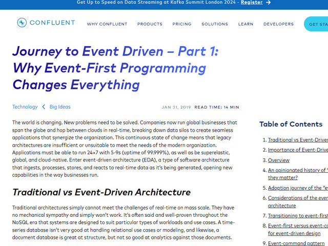

### Architecture

---

| Category       | Type      | Description                                                     | Why                                                                                                                                                        | Link                                                                                                                                                                                                                                                                                 |
| :------------- | :-------- | :-------------------------------------------------------------- | :--------------------------------------------------------------------------------------------------------------------------------------------------------- | :----------------------------------------------------------------------------------------------------------------------------------------------------------------------------------------------------------------------------------------------------------------------------------- |
| `ARCHITECTURE` | `ARTICLE` | How to Build an End to End Production-Grade Architecture on AWS | Great three parter on how to approach a more traditional production grade architecture from VPC, deployment, monitoring, load balancing etc... perspective |  |
| `EVENTDRIVEN`  | `ARTICLE` | Journey to Event Driven                                         | Although leaning heavily on Kafka there is a lot of good stuff here about event-driven design in this 4 parter series                                      |                         |
