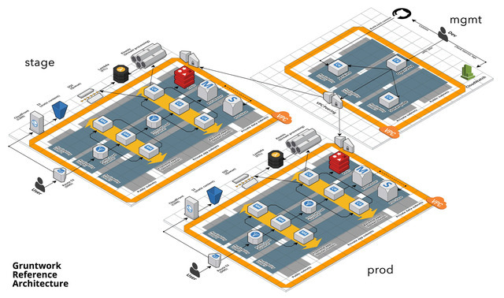

### Architecture

---

| Category       | Type   | Description                                                     | Why                                                                                                                                                        | Link                                                                                                                                                                                                                                                                                 |
| :------------- | :----- | :-------------------------------------------------------------- | :--------------------------------------------------------------------------------------------------------------------------------------------------------- | :----------------------------------------------------------------------------------------------------------------------------------------------------------------------------------------------------------------------------------------------------------------------------------- |
| `Architecture` | `BLOG` | How to Build an End to End Production-Grade Architecture on AWS | Great three parter on how to approach a more traditional production grade architecture from VPC, deployment, monitoring, load balancing etc... perspective |  |
