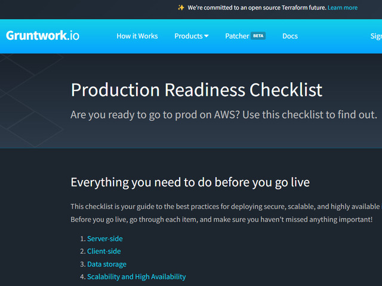

### DevOps

---

| Category | Type    | Description                                  | Why                                                                                                             | Link                                                                                                                                                         |
| :------- | :------ | :------------------------------------------- | :-------------------------------------------------------------------------------------------------------------- | :----------------------------------------------------------------------------------------------------------------------------------------------------------- |
| `CI/CD`  | `VIDEO` | How to design a modern CI/CD Pipeline        | Short video on how to create a pipeline that gets you from committing code to creating a release ready artifact |                    |
| `CI/CD`  | `VIDEO` | How to design a Deployment Pipeline (GitOps) | Short video on how to deploy artifacts to different environments                                                |                    |
| `DevOps` | `BLOG`  | Production Readiness Checklist               | Concise list of bullet points that you want to run through to make sure you are production ready                |  |
