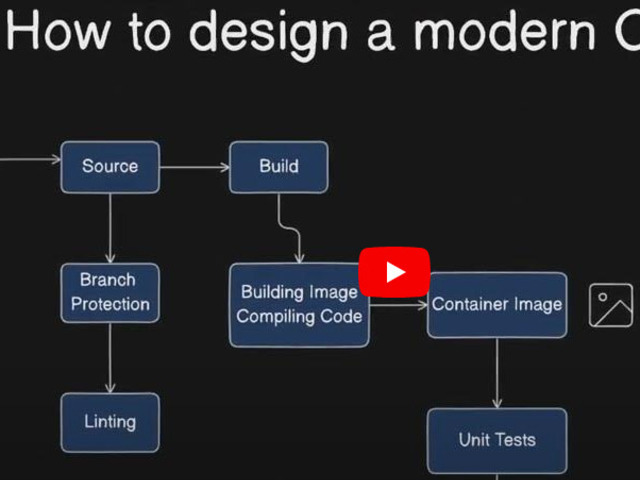
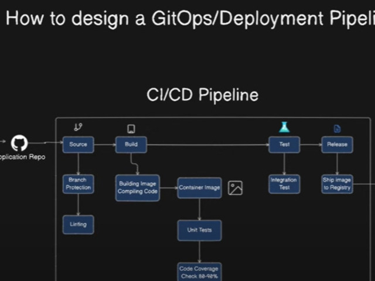

### <u>DevOps</u>

Collection of useful DevOps related bookmarks

---

| Category | Type    | Description                                  | Why                                                                                                 | Link                                                                                                                                       |
| :------- | :------ | :------------------------------------------- | :-------------------------------------------------------------------------------------------------- | :----------------------------------------------------------------------------------------------------------------------------------------- |
| `CI/CD`  | `VIDEO` | How to design a modern CI/CD Pipeline        | Summay on how a build pipeline looks like from committing code to creating a release ready artifact |  |
| `CI/CD`  | `VIDEO` | How to design a Deployment Pipeline (GitOps) | Summary on how to deploy artifacts to different environments                                        |  |
